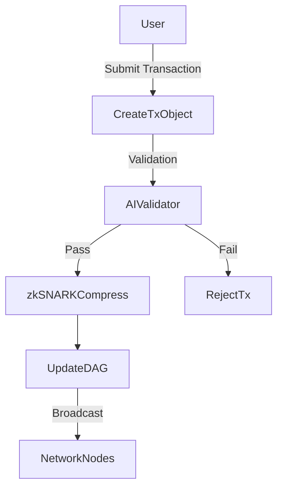

# Transaction Execution Flowchart

Below is the execution flow for a transaction in Repeater Chain:

---

## Explanation of Steps:

1. **User Request Tx**: 
   A user initiates a transaction request via the wallet or API.

2. **Create Transaction Object**:
   The transaction is serialized into a standard object format.

3. **AI Validator**:
   The transaction is passed to an AI model for off-chain validation:
   - Checks include: double-spending, spam, or malicious patterns.
   - If valid, it proceeds; otherwise, it is rejected.

4. **zk-SNARK Compression**:
   Once validated, the transaction is compressed into a zero-knowledge proof.

5. **Update DAG Node**:
   The transaction is appended to the DAG structure, maintaining efficiency.

6. **Broadcast**:
   The updated DAG node is broadcast to all network nodes for synchronization.